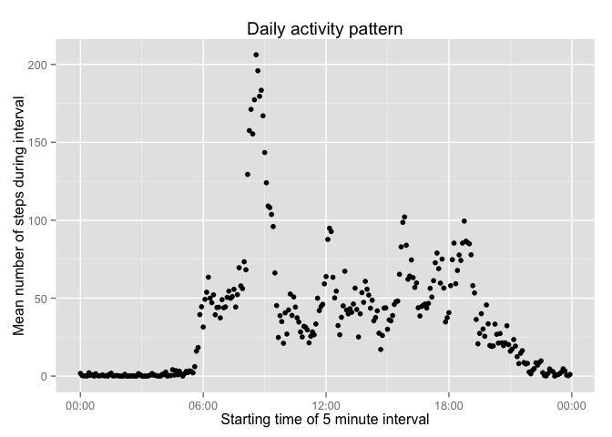
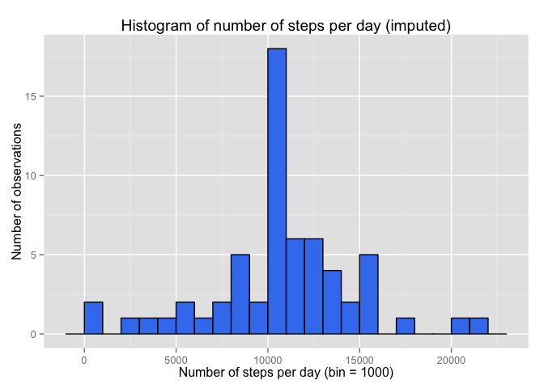
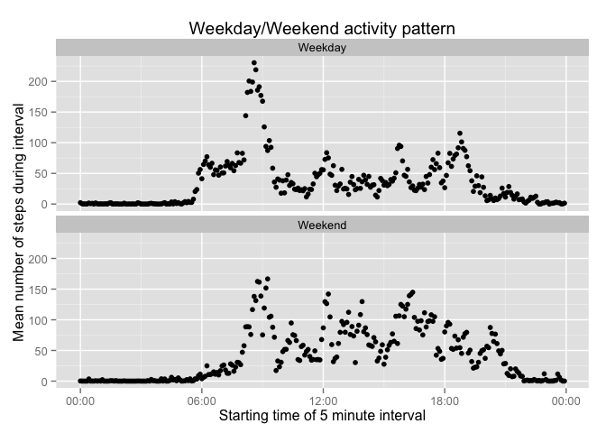

# Reproducible Research: Peer Assessment 1
Steve Kaiser (https://github.com/smkaiser)  


## Loading and preprocessing the data

```r
# load libraries
library(lubridate)
library(ggplot2)
library(scales)
# Download and unzip the data if necessary
if (!file.exists("./activity.csv")) {
    download.file(url = "https://d396qusza40orc.cloudfront.net/repdata%2Fdata%2Factivity.zip", destfile = "./activity.zip", method = "curl", mode = "wb")
    unzip(zipfile = "./activity.zip", overwrite = TRUE, setTimes = TRUE)  
}
fileinfo <- file.info("./activity.csv")
activity <- read.csv("./activity.csv", colClasses = c("integer", "Date", "integer"))
```
Data file last modified: **2014-02-11 10:08:20** (local time)

## What is the mean total number of steps taken per day?

```r
# ignore missing (NA) values
histdata <- activity[!is.na(activity$steps),]
# calculate mean and median
steptotals = aggregate(histdata$steps, list(histdata$date), FUN = sum)
stepmean = format(mean(steptotals$x), scientific = F)
stepmedian = format(median(steptotals$x), scientific = F)
# plot histogram
ggplot(steptotals, aes(x = x)) + geom_histogram(fill="#4080F0", color="black", binwidth=1000) +
    scale_y_continuous(breaks=pretty_breaks()) +
    xlab("Number of steps per day (bin = 1000)") +
    ylab("Number of observations") +
    ggtitle("Histogram of number of steps per day")
```

 

Mean steps per day: **10766**

Median steps per day: **10765**

## What is the average daily activity pattern?

```r
# Group the mean total steps by 5-minute intervals 
intervalsteps = aggregate(histdata$steps, list(histdata$interval), FUN=mean)
# Convert interval to a real time value
names(intervalsteps) = c("Interval", "MeanSteps")
intervalsteps$Time <- parse_date_time(sprintf("%04d", intervalsteps$Interval), "hm")
# Find the interval with the highest avg steps
maxinterval = intervalsteps[intervalsteps$MeanSteps == max(intervalsteps$MeanSteps),2:3]
# Plot the time series
#plot(intervalsteps$Time, intervalsteps$MeanSteps, xlab = "Starting time of 5 minute interval", ylab="Mean number of steps during interval", main="Daily activity pattern")
ggplot(intervalsteps, aes(x=Time, y=MeanSteps)) + 
    geom_point() + 
    scale_x_datetime(labels = date_format("%H:%M")) +
    xlab("Starting time of 5 minute interval") +
    ylab("Mean number of steps during interval") +
    ggtitle("Daily activity pattern")
```

 

The 5-minute interval with the highest average steps starts at **08:35 AM**, with **206.1698** steps.

## Imputing missing values
There are **2304** instances of missing values for the `steps` variable.

Missing values will be imputed by replacing them with the mean number of steps for that interval.

```r
# select only the NA rows from activity
naonly <- activity[is.na(activity$steps),]
# merge with the means per interval
imputed <- merge(naonly, intervalsteps, by.x="interval", by.y="Interval")
names(imputed) = c("interval", "NA", "date", "steps", "time")
# combine the imputed values with histdata. # rows should equal that of the original activity data.frame
newdata <- rbind(histdata, imputed[,c("steps", "date", "interval")])
# calculate mean and median
steptotals = aggregate(newdata$steps, list(newdata$date), FUN = sum)
stepmean = format(mean(steptotals$x), scientific = F)
stepmedian = format(median(steptotals$x), scientific = F)
# plot histogram
ggplot(steptotals, aes(x = x)) + geom_histogram(fill="#4080F0", color="black", binwidth=1000) +
    scale_y_continuous(breaks=pretty_breaks()) +
    xlab("Number of steps per day (bin = 1000)") +
    ylab("Number of observations") +
    ggtitle("Histogram of number of steps per day (imputed)")
```

 

Mean steps per day (imputed): **10766**

Median steps per day (imputed): **10766**

## Are there differences in activity patterns between weekdays and weekends?

```r
is_weekday <- function(s) {
    ifelse (wday(s)==1 | wday(s) == 7, "Weekend", "Weekday")
}
# Add a column that indicates whether the date is weekday or weekend day
newdata$weekday <- factor(is_weekday(newdata$date))
intervalsteps = aggregate(newdata$steps, list(newdata$interval, newdata$weekday), FUN=mean)
# Convert interval to a real time value
names(intervalsteps) = c("Interval", "Weekday", "MeanSteps")
intervalsteps$Time <- parse_date_time(sprintf("%04d", intervalsteps$Interval), "hm")
# Find the interval with the highest avg steps
maxinterval = intervalsteps[intervalsteps$MeanSteps == max(intervalsteps$MeanSteps),2:3]
# Plot the time series
#plot(intervalsteps$Time, intervalsteps$MeanSteps, xlab = "Starting time of 5 minute interval", ylab="Mean number of steps during interval", main="Daily activity pattern")
ggplot(intervalsteps, aes(x=Time, y=MeanSteps)) + 
    geom_point() + 
    scale_x_datetime(labels = date_format("%H:%M")) +
    xlab("Starting time of 5 minute interval") +
    ylab("Mean number of steps during interval") +
    ggtitle("Weekday/Weekend activity pattern") +
    facet_wrap(~ Weekday, ncol=1)
```

 
